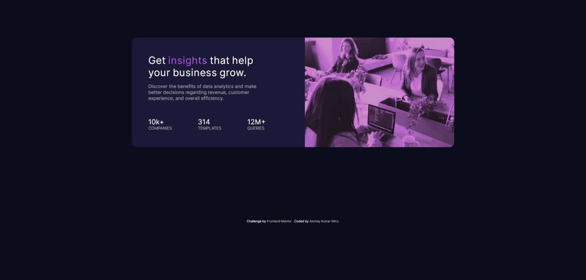
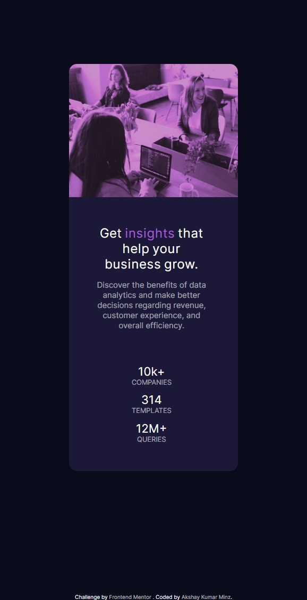

# Frontend Mentor - Stats preview card component solution

This is a solution to the [Stats preview card component challenge on Frontend Mentor](https://www.frontendmentor.io/challenges/stats-preview-card-component-8JqbgoU62). 
Frontend Mentor challenges help you improve your coding skills by building realistic projects. 

## Table of contents

 - [The challenge](#the-challenge)
  - [Screenshot](#solution)
  - [Links](#https://akshayv30.github.io/FrontEndMentorChallenge_v1/)
  - [Built with](#only HTML & CSS)
   - [Useful resources](#udemy)
- [Author](#AkshayMinz)

**Note: Delete this note and update the table of contents based on what sections you keep.**

### The challenge

Users may be able to:

- View the optimal layout depending on their device's screen size 

### Screenshot of my solution. 

The desktop version as well as mobile version of the solution was done.

### Links

- Solution URL: (https://github.com/AkshayV30/FrontEndMentorChallenge_v1)
- Live Site URL: (https://akshayv30.github.io/FrontEndMentorChallenge_v1/)

### Built with

- Semantic HTML5 markup
- CSS custom properties
- Flexbox
- Desktop-first workflow

### Continued development

Use this section to outline areas that you want to continue focusing on in future projects. 
These could be concepts you're still not completely comfortable with or techniques you found useful that you want to refine and perfect.

### Useful resources

- (https://www.udemy.com) - This helped me for clearing out my basics.
-(https://www.w3schools.com/css/)
-(https://developer.mozilla.org/en-US/docs/Web/CSS)
## Author

- Website - [AkshayMinz](https://github.com/AkshayV30)
- Frontend Mentor - [@AkshayV30](https://www.frontendmentor.io/profile/AkshayV30)

# statsPreviewCardComponentMain
